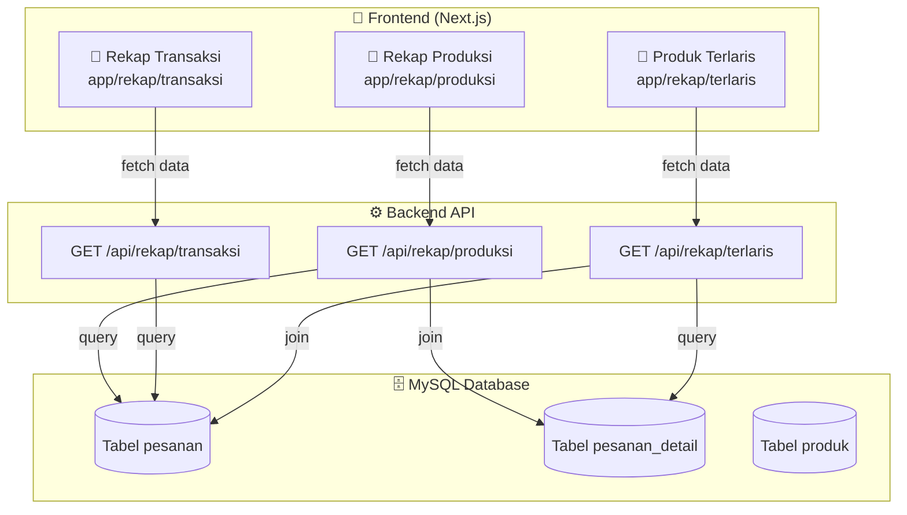
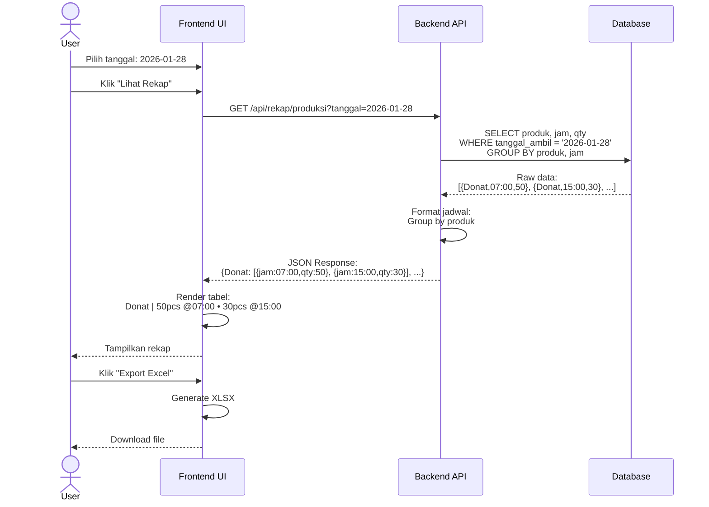
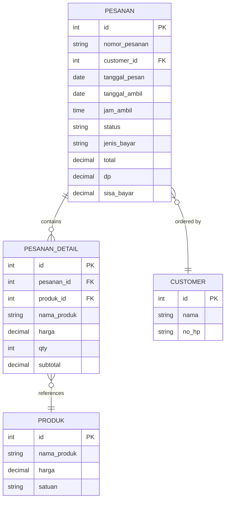
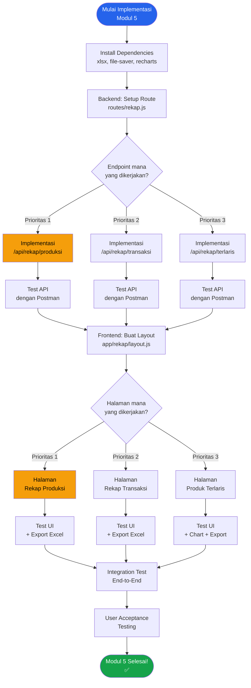
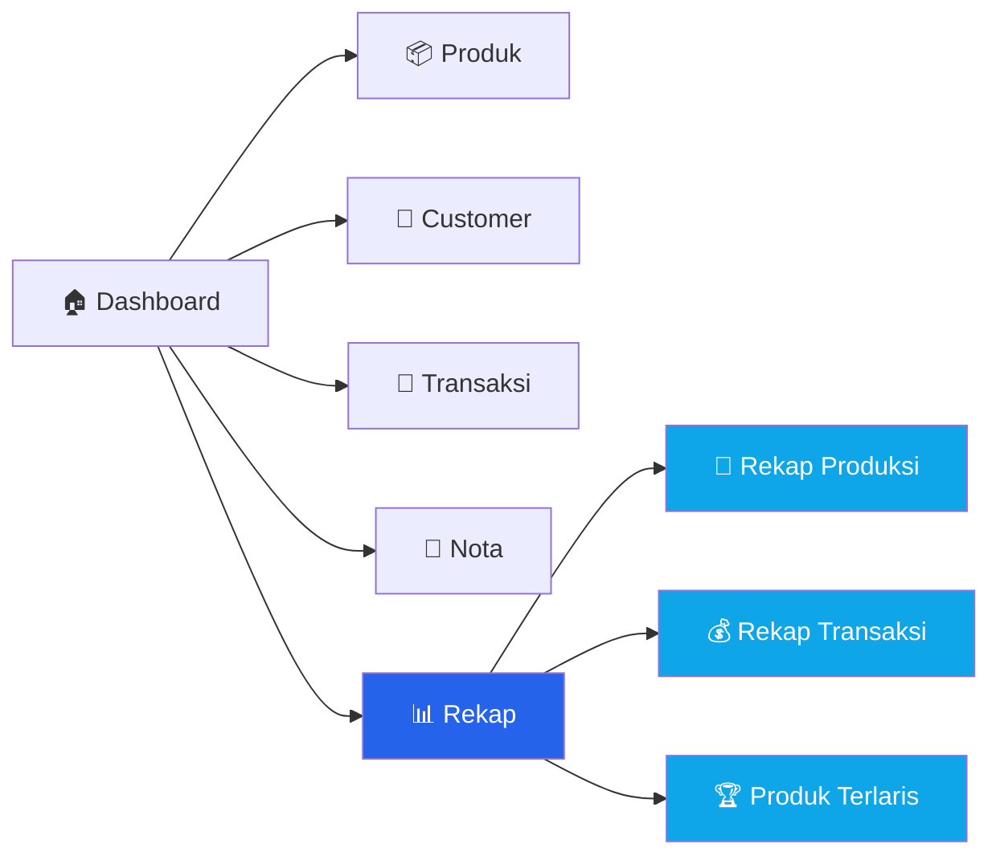
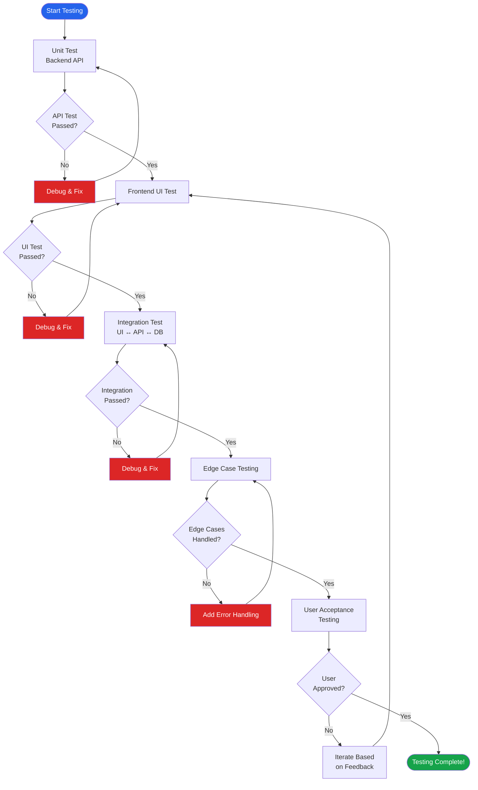
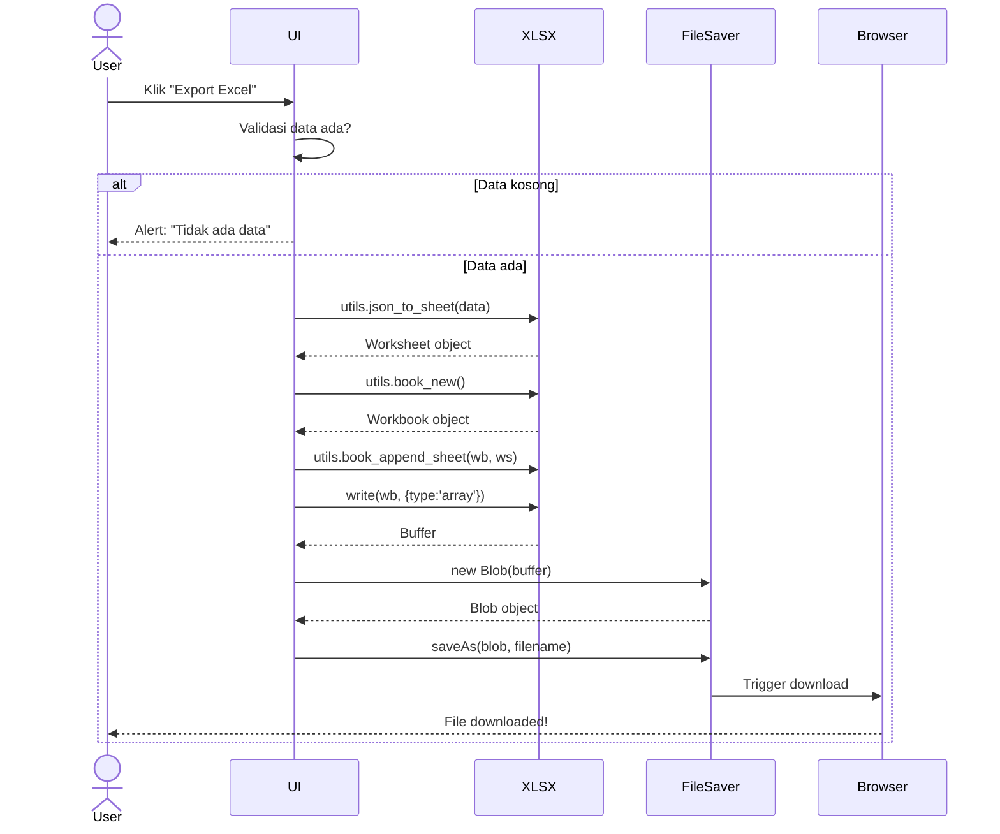
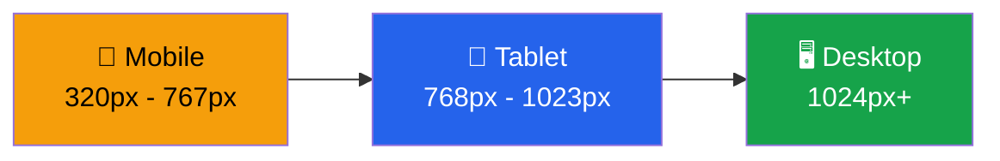
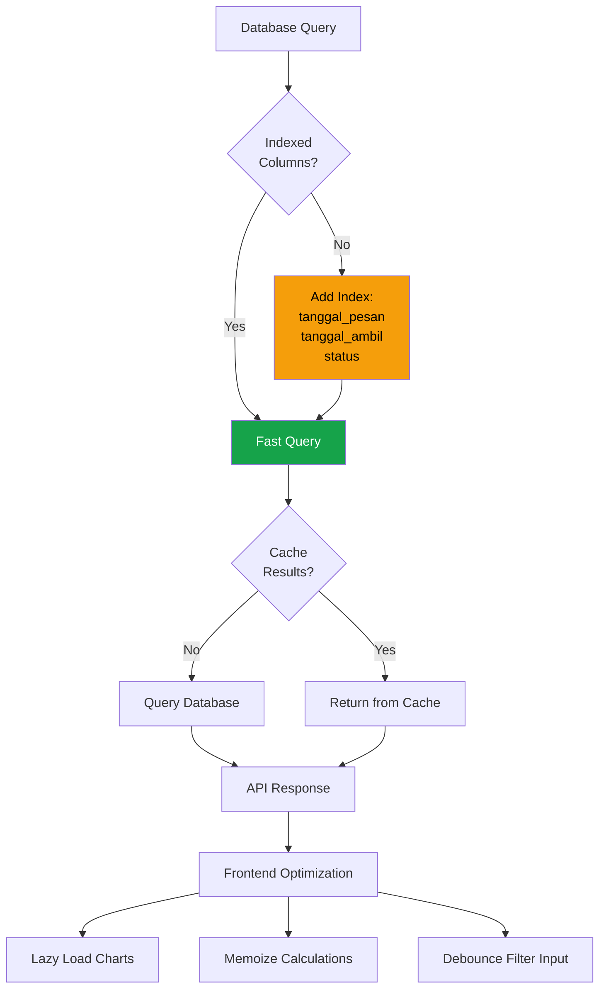

# Diagram & Visualisasi - Modul 5

> Diagram visual untuk memudahkan pemahaman arsitektur dan flow Modul 5

---

## 🏗️ Arsitektur Modul 5



---

## 📊 Data Flow: Rekap Produksi



---

## 🔄 Data Transformation: Rekap Produksi

### Input: Query Result dari Database

```json
[
  { "nama_produk": "Donat", "jam_ambil": "07:00", "total_qty": 50 },
  { "nama_produk": "Donat", "jam_ambil": "15:00", "total_qty": 30 },
  { "nama_produk": "Donat", "jam_ambil": "17:00", "total_qty": 40 },
  { "nama_produk": "Roti Coklat", "jam_ambil": "07:00", "total_qty": 20 },
  { "nama_produk": "Roti Coklat", "jam_ambil": "10:00", "total_qty": 15 }
]
```

### Transformasi di Backend

```javascript
// Grouping by nama_produk
const grouped = {};

queryResults.forEach(row => {
  if (!grouped[row.nama_produk]) {
    grouped[row.nama_produk] = {
      nama_produk: row.nama_produk,
      jadwal: [],
      total_qty: 0
    };
  }
  
  grouped[row.nama_produk].jadwal.push({
    jam: row.jam_ambil,
    qty: row.total_qty
  });
  
  grouped[row.nama_produk].total_qty += row.total_qty;
});

const result = Object.values(grouped);
```

### Output: Response API

```json
{
  "success": true,
  "tanggal": "2026-01-28",
  "data": [
    {
      "nama_produk": "Donat",
      "total_qty": 120,
      "jadwal": [
        { "jam": "07:00", "qty": 50 },
        { "jam": "15:00", "qty": 30 },
        { "jam": "17:00", "qty": 40 }
      ]
    },
    {
      "nama_produk": "Roti Coklat",
      "total_qty": 35,
      "jadwal": [
        { "jam": "07:00", "qty": 20 },
        { "jam": "10:00", "qty": 15 }
      ]
    }
  ]
}
```

### Display di Frontend

```
┌───────────────┬─────────────────────────────────────────────────┐
│ Produk        │ Jadwal (qty @jam)                               │
├───────────────┼─────────────────────────────────────────────────┤
│ Donat         │ 50pcs @07:00 • 30pcs @15:00 • 40pcs @17:00      │
│ Roti Coklat   │ 20pcs @07:00 • 15pcs @10:00                     │
└───────────────┴─────────────────────────────────────────────────┘
Total: 2 produk, 155 pcs
```

---

## 📈 Database Schema untuk Modul 5



**Catatan**:
- Modul 5 fokus pada tabel `PESANAN` dan `PESANAN_DETAIL`
- Field `nama_produk` di `PESANAN_DETAIL` adalah **snapshot** saat transaksi
- Filter berdasarkan `status != 'DIBATALKAN'`

---

## 🎯 Flow Chart: Implementasi Step-by-Step



---

## 🗺️ Navigation Map



---

## 📊 Contoh Data: Rekap Transaksi

### Input: Database Records
```
pesanan table:
+----+------------------+-----------+--------+-----------+
| id | nomor_pesanan    | status    | jenis  | total     |
+----+------------------+-----------+--------+-----------+
| 1  | ORD-20260128-001 | SELESAI   | LUNAS  | 150000    |
| 2  | ORD-20260128-002 | DIPROSES  | DP     | 200000    |
| 3  | ORD-20260128-003 | BARU      | DP     | 180000    |
| 4  | ORD-20260128-004 | DIBATALKAN| DP     | 100000    |
+----+------------------+-----------+--------+-----------+
```

### Processing Logic
```javascript
// Count per status
const statusCounts = {
  BARU: 1,
  DIPROSES: 1,
  SELESAI: 1,
  DIBATALKAN: 1  // Excluded from financial calculation
};

// Financial summary (exclude DIBATALKAN)
const total_transaksi = 150000 + 200000 + 180000 = 530000;
const total_lunas = 150000;
const total_dp = (200000 * 0.5) + (180000 * 0.5) = 190000; // Assume 50% DP
const sisa_tagihan = 530000 - 150000 - 190000 = 190000;
```

### Output: API Response
```json
{
  "success": true,
  "tanggal": "2026-01-28",
  "data": {
    "total_pesanan": 4,
    "pesanan_baru": 1,
    "pesanan_diproses": 1,
    "pesanan_siap": 0,
    "pesanan_selesai": 1,
    "pesanan_batal": 1,
    "total_transaksi": 530000,
    "total_dp": 190000,
    "total_lunas": 150000,
    "sisa_tagihan": 190000
  }
}
```

---

## 🎨 UI Component Structure

### Rekap Produksi Page

```
RekapProduksiPage
├── Header
│   └── Title: "🎂 Rekap Produksi Harian"
├── FilterSection
│   ├── DatePicker (tanggal)
│   └── Button "Lihat Rekap"
├── SummaryCards
│   ├── Card: Total Produk
│   └── Card: Total Qty
├── DataTable
│   ├── TableHeader
│   │   ├── Column: "Produk"
│   │   └── Column: "Jadwal (qty @jam)"
│   └── TableBody
│       └── TableRow (foreach product)
│           ├── Cell: nama_produk
│           └── Cell: formatted_jadwal
├── ActionButtons
│   ├── Button "Export Excel"
│   └── Button "Cetak"
└── LoadingState / EmptyState / ErrorState
```

---

## 🔍 SQL Query Visualization

### Query: Rekap Produksi

```sql
SELECT 
    pd.nama_produk,      -- Nama produk
    p.jam_ambil,         -- Jam pengambilan
    SUM(pd.qty) AS qty   -- Total qty untuk jam tersebut
FROM pesanan p
JOIN pesanan_detail pd ON p.id = pd.pesanan_id
WHERE p.tanggal_ambil = '2026-01-28'
  AND p.status != 'DIBATALKAN'
GROUP BY pd.nama_produk, p.jam_ambil
ORDER BY pd.nama_produk, p.jam_ambil;
```

**Visualisasi Hasil Query**:
```
┌─────────────┬───────────┬─────┐
│ nama_produk │ jam_ambil │ qty │
├─────────────┼───────────┼─────┤
│ Donat       │ 07:00     │ 50  │
│ Donat       │ 15:00     │ 30  │
│ Donat       │ 17:00     │ 40  │
│ Roti Coklat │ 07:00     │ 20  │
│ Roti Coklat │ 10:00     │ 15  │
└─────────────┴───────────┴─────┘
```

**Setelah Transformasi Backend** → Format jadwal horizontal:
```
┌─────────────┬──────────────────────────────────────┐
│ nama_produk │ jadwal                               │
├─────────────┼──────────────────────────────────────┤
│ Donat       │ 50pcs @07:00 • 30pcs @15:00 • ...   │
│ Roti Coklat │ 20pcs @07:00 • 15pcs @10:00          │
└─────────────┴──────────────────────────────────────┘
```

---

## 📦 File Structure Tree

```
e:\Kasir\
├── backend\
│   ├── routes\
│   │   ├── produk.js
│   │   ├── customer.js
│   │   ├── transaksi.js
│   │   └── rekap.js          ← NEW (Modul 5)
│   └── server.js             ← UPDATE (register /api/rekap)
│
├── frontend\
│   └── app\
│       ├── produk\
│       ├── customer\
│       ├── transaksi\
│       ├── nota\
│       └── rekap\            ← NEW (Modul 5)
│           ├── layout.js
│           ├── page.js
│           ├── produksi\
│           │   └── page.js
│           ├── transaksi\
│           │   └── page.js
│           └── terlaris\
│               └── page.js
│
└── Docs\
    ├── output_modul.md       ← EXISTING
    ├── modul_5_rekap_laporan.md    ← NEW
    ├── modul_5_quick_start.md      ← NEW
    └── modul_5_diagram.md          ← THIS FILE
```

---

## 🧪 Testing Flow Diagram



---

## 💾 Export Excel Flow



---

## 📱 Responsive Design Breakpoints



### Layout Adjustments

**Mobile (< 768px)**:
- Stack cards vertically
- Horizontal scroll for wide tables
- Collapse navigation to hamburger menu
- Single column layout

**Tablet (768px - 1023px)**:
- 2-column grid for cards
- Table with reduced padding
- Visible navigation

**Desktop (1024px+)**:
- 3-4 column grid for cards
- Full-width tables
- Sidebar navigation
- Chart in larger size

---

## 🚀 Performance Optimization



---

## 📊 Chart Example: Produk Terlaris

### Bar Chart Visualization

```
Produk Terlaris (Januari 2026)

Qty Terjual
    │
1250│     █████
    │     █████
1000│     █████
    │     █████      █████
 750│     █████      █████      █████
    │     █████      █████      █████
 500│     █████      █████      █████      █████
    │     █████      █████      █████      █████
 250│     █████      █████      █████      █████
    │     █████      █████      █████      █████
   0└─────┴─────────┴─────────┴─────────┴─────────
        Donat    Roti      Kue      Brownies
                Coklat    Lapis
```

**Implementation with Recharts**:
```javascript
<BarChart data={chartData} width={600} height={300}>
  <CartesianGrid strokeDasharray="3 3" />
  <XAxis dataKey="nama_produk" />
  <YAxis />
  <Tooltip />
  <Legend />
  <Bar dataKey="total_qty" fill="#2563eb" />
</BarChart>
```

---

*Diagram ini dibuat untuk memudahkan visualisasi implementasi Modul 5*  
*Last Updated: 28 Januari 2026*
